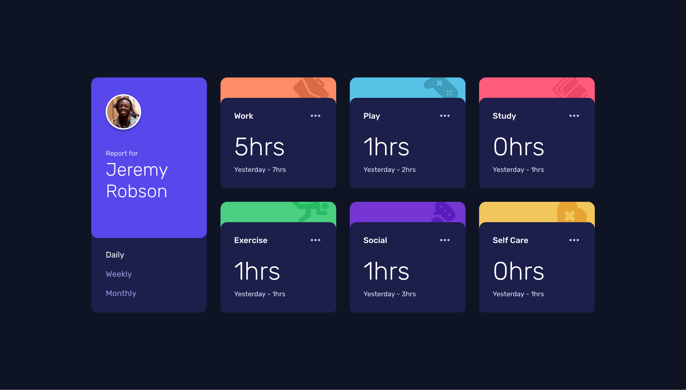
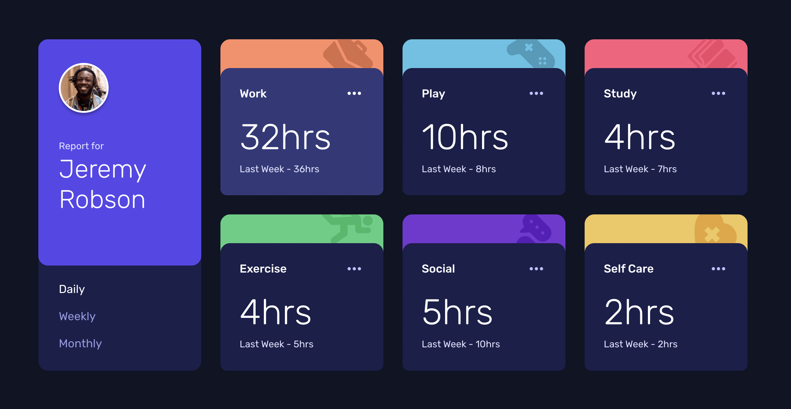
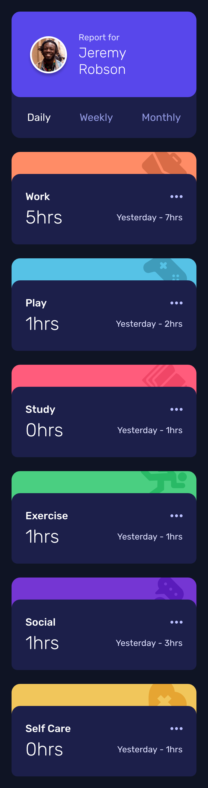

# Frontend Mentor - Time tracking dashboard solution

This is a solution to the [Time tracking dashboard challenge on Frontend Mentor](https://www.frontendmentor.io/challenges/time-tracking-dashboard-UIQ7167Jw). Frontend Mentor challenges help you improve your coding skills by building realistic projects.

## Table of contents

- [The challenge](#the-challenge)
- [Screenshots](#screenshots)
  - [1. Desktop version](#1-desktop-version)
  - [2. Mobile version](#2-mobile-version)
- [PageSpeed Insights results](#pagespeed-insights-results)
- [Links](#links)
- [My process](#my-process)
  - [Built with](#built-with)
  - [Tested with](#tested-with)
  - [What I learned](#what-i-learned)
- [Acknowledgement](#acknowledgement)
- [Author](#author)

## Overview

### The challenge

Users should be able to:

- View the optimal layout for the site depending on their device's screen size
- See hover states for all interactive elements on the page
- Switch between viewing Daily, Weekly, and Monthly stats

### Screenshots

##### 1. Desktop version

Default state


Hover state


##### 2. Mobile version

Default state


### PageSpeed Insights results

[Mobile version](ttps://pagespeed.web.dev/analysis/https-rupali317-github-io-time-tracking-dashboard-main/5z9gefggoz?form_factor=mobile)

[Desktop version](https://pagespeed.web.dev/analysis/https-rupali317-github-io-time-tracking-dashboard-main/5z9gefggoz?form_factor=desktop)

### Links

- Solution URL: [Time tracking dashboard solution URL](https://github.com/rupali317/time-tracking-dashboard-main)
- Live Site URL: [Time tracking dashboard live URL](https://rupali317.github.io/time-tracking-dashboard-main/)

## My process

### Built with

- Semantic HTML5 markup
- CSS custom properties
- Flexbox
- Mobile-first workflow
- CSS Grid
- Javascript
- [Github Pages](https://pages.github.com/) - Allows to host static websites directly from a GitHub repository.

### Tested with

- Browsers used for testing: Google Chrome, Firefox, Safari, Brave, Microsoft Edge.
- Devices:
  - (Real) MacBook Pro (14-inch), Huawei Mate 20 Pro, Samsung Galaxy S20+, iPad Air (13-inch), MacBook Pro (13-inch).
  - (Virtual) The mobile and tablet devices mentioned under Chrome's dev console.
- Screen reader: MacOS VoiceOver.

### What I learned

TBD

To see how you can add code snippets, see below:

```html
<h1>Some HTML code I'm proud of</h1>
```

```css
.proud-of-this-css {
  color: papayawhip;
}
```

```js
const proudOfThisFunc = () => {
  console.log("🎉");
};
```

## Acknowledgement

- In all my projects, I always refer to CSS reset to provide a clean/consistent slate for the CSS stylings across all the browsers. [Joshua's CSS reset](https://www.joshwcomeau.com/css/custom-css-reset/), [Andy Bell's CSS reset](https://piccalil.li/blog/a-more-modern-css-reset/)

## Author

- Linkedin profile - [Rupali Roy Choudhury](https://www.linkedin.com/in/rupali-rc/)
- Frontend Mentor - [@rupali317](https://www.frontendmentor.io/profile/rupali317)
